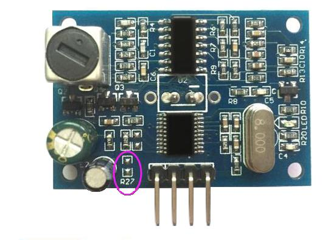
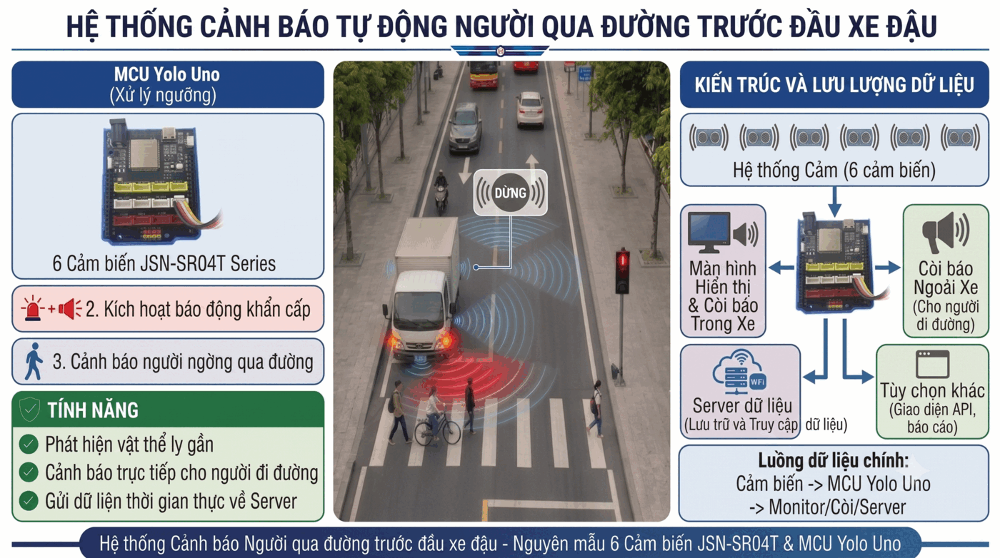

# UMT-TBS-official

Hệ thống **Cảnh báo va chạm xe tải (Truck Blind-spot Warning System)** — repo chính thức
**V2** (Greenfield). Phần cứng: **ESP32-S3** + **6 cảm biến siêu âm chống nước
JSN-SR04T** + màn hình **Waveshare 7" RGB LVGL v9** (GT911). Kế thừa từ repo
`supersonic-warning-system` (V1) và sửa các lỗi kiến trúc cũ (hợp đồng copy-paste,
ngưỡng rải rác, secret hardcode, thiếu CI/kiểm thử).

<p align="center">
  
  <em>Cảm biến siêu âm JSN-SR04T (6× quanh xe)</em>
</p>

## Kiến trúc Hybrid (V2)

| Đường | Vai trò | Giao thức | Độ trễ mục tiêu |
|---|---|---|---|
| **ESP-NOW (chính)** | Cảnh báo critical path giữa sensor-node → waveshare-screen | ESP-NOW, shared header duy nhất | < 50 ms |
| **CoreIoT / MQTT (phụ)** | Giám sát từ xa, Rule-Chain, dashboard (yêu cầu cloud) | MQTT `v1/devices/me/telemetry` | 100–500 ms |

```text
 ┌──────────────────────────┐
 │  Cảm biến JSN-SR04T x6    │ (S1..S6 quanh xe, Trig/Echo GPIO)
 └────────────┬─────────────┘
              ▼
 ┌──────────────────────────┐
 │  ESP32-S3 Sensor Node     │ firmware/sensor-node — đo/lọc, còi cục bộ (GPIO11)
 ├── ESP-NOW ────────────────┤ channel 1, 500 ms, no-AP
 └── MQTT ───────────────────┘ CoreIoT (app.coreiot.io) — rule-chain → dashboard
              ▼
 ┌──────────────────────────┐
 │  Waveshare Screen Node    │ firmware/waveshare-screen — LVGL v9, ESP-NOW + MQTT
 └──────────────────────────┘
```

<p align="center">
  
  <em>Sơ đồ kiến trúc hệ thống Hybrid V2</em>
</p>

Hợp đồng dùng chung giữa 2 board **chỉ nằm ở `firmware/shared/`** (R2/R3/R4):
- `espnow_protocol.h` — payload ESP-NOW packed (30 B), kênh, MAC, slot, `static_assert`;
- `thresholds.h` — vùng cảnh báo **CAUTION ≤ 100 cm / DANGER ≤ 30 cm**, chân 6 cảm biến
  (FRONT 5/6, LEFT_FRONT 7/8, RIGHT_FRONT 9/10, LEFT_REAR 17/18, RIGHT_REAR 21/38,
  REAR 3/4 — *không dùng GPIO47/48 do PSRAM*), còi WARNING <50 cm (3 s) / DANGER <20 cm (1 s).

## Cấu trúc repo

```
firmware/          shared/ (hợp đồng), sensor-node (Arduino), waveshare-screen (ESP-IDF thuần)
cloud/             coreiot/rule_chain/ — snapshot Rule-Chain (R11)
tools/             test_mqtt_coreiot.py (B9), guard/ (scan_secrets, gen_credentials, ...)
report/            Báo cáo LaTeX (4 chương) — build: make -C report
docs/logs/         Nhật ký triển khai từng nhiệm vụ
.opencode/docs/    CONSTITUTION (R1–R12), SELFCHECK, ROADMAP_CHECKLIST
.github/workflows/ ci.yml — build 2 env × 2 firmware + host test + Gitleaks + guards
```

## Yêu cầu

- **Phần cứng**: 2 board ESP32-S3; 6× JSN-SR04T; Waveshare 7" RGB LCD; buzzer; máy Windows/Linux (cổng `/dev/ttyACM0` sensor, `/dev/ttyACM1` screen).
- **Phần mềm**: Python 3.12+, PlatformIO Core (`espressif32@7.0.1` đã pin); `paho-mqtt` (chỉ khi nghiệm thu cloud: `pip install -r tools/requirements.txt`); LVGL v9/GT911 qua `idf_component.yml` (tự tải khi build); Node ≥20 (plugin guard opencode).

## Cài đặt nhanh

```bash
# 1. Key local (gitignored — KHÔNG commit)
cp config/keys.template.json config/keys.json   # điền token CoreIoT MỚI (R11)

# 2. Guard tools (Python)
python3 tools/guard/gen_credentials.py --check

# 3. PlatformIO (cả 2 firmware)
pip install platformio
```

## Build & Flash

```bash
# Sensor node (mặc định ESP-NOW; bản CoreIoT dùng yolo_uno_coreiot — R6)
cd firmware/sensor-node
pio run -e yolo_uno                            # ESP-NOW only
pio run -e yolo_uno_coreiot                    # + CoreIoT/MQTT
pio run -e yolo_uno -t upload --upload-port /dev/ttyACM0
pio device monitor -p /dev/ttyACM0 -b 115200

# Waveshare screen
cd firmware/waveshare-screen
pio run -e yolo_uno
pio run -e yolo_uno -t upload --upload-port /dev/ttyACM1
pio device monitor -p /dev/ttyACM1 -b 115200
```

`waveshare-screen` dùng `framework = espidf` thuần (không Arduino) vì driver RGB/GT911/
LVGL v9 cần ESP-IDF ≥5.5. Không có `build_and_flash.bat` ở V2 — dùng lệnh `pio` trực tiếp.

## Kiểm thử cục bộ (không cần board)

```bash
python3 tools/guard/scan_secrets.py                 # R1 — quét secret trong file tracked
python3 tools/guard/gen_credentials.py --check      # keys.json đủ field
python3 tools/guard/check_rulechain_thresholds.py   # R11 — snapshot vs thresholds.h (OK)
make -C report                                      # build báo cáo LaTeX (tùy chọn)
~/.venv-platformio/bin/python -m pytest tools/guard/test_guard.py -q   # 16 passed
cd firmware/sensor-node && pio test -e native       # 10/10 host test (firmware)
```

## Nghiệm thu CoreIoT (B9)

1. Tạo **token MỚI** trên `app.coreiot.io` cho 2 device (sensor + screen) — **không tái dùng token đã lộ ở repo cũ** (R11).
2. Import `cloud/coreiot/rule_chain/supersonic_rule_chain.json` làm root rule-chain của sensor-node.
3. Điền `config/keys.json` (token + Wi-Fi) rồi thử:
```bash
python3 tools/test_mqtt_coreiot.py --dry-run --distance 80     # không cần token
python3 tools/test_mqtt_coreiot.py --distance 15.5            # → dashboard warning_status = DANGER
python3 tools/test_mqtt_coreiot.py --distance 60              # → CAUTION
python3 tools/test_mqtt_coreiot.py --distance 150             # → NORMAL
python3 tools/test_mqtt_coreiot.py --loop --interval 2        # diễn biến liên tục
```

<p align="center">
  
  <em>Rule-Chain CoreIoT xử lý telemetry thành `warning_status`</em>
</p>

<p align="center">
  
  <em>Dashboard giám sát từ xa (CoreIoT / ThingsBoard)</em>
</p>

## Quy tắc bắt buộc (tóm tắt R1–R12 — đầy đủ ở `.opencode/docs/CONSTITUTION.md`)

- **R1** Secret chỉ ở `config/keys.json`/file sinh từ nó; literal token/password trong tracked file = P0.
- **R2/R3/R4** Shared contract & ngưỡng chỉ ở `firmware/shared/`; `SENSOR_COUNT` từ `sizeof` + `static_assert`.
- **R5/R6/R7** Không demo trong production; module chết phải build ≥1 env hoặc xoá; file ≤ 400 dòng.
- **R8/R9** Không track `sdkconfig*`/`keys.json`; 1 remote, commit conventional, cấm `git add -A`.
- **R10/R11** Mọi task có DoD kèm lệnh xác minh; rule-chain snapshot + token tự sinh.
- **R12** Làm theo roadmap (`/plan` → `/step N`), tối thiểu agent.

## Git workflow (R8/R9)

```bash
git pull origin main --rebase
# ... edit ...
/verify                 # quét secret + selfcheck (opencode command)
git add <file cụ thể>   # CẤM git add -A / .
git commit -m "<type>: <mô tả>"   # feat/fix/docs/refactor/chore/test/ci
git push origin main
```

Sau mỗi nhiệm vụ bắt buộc ghi `docs/logs/<COMPONENT>_<TASK>_LOG.md`.

## Trạng thái lộ trình

- [x] **B0/B1:** Repo mới + cấu hình opencode 4 tầng (commit đầu)
- [x] **B2–B5:** `firmware/shared` contract + scaffold 2 firmware + wire ESP-NOW
- [x] **B6e/B7:** Guard tools + CI (build/host test/pytest/Gitleaks/size-gate — run xanh)
- [x] **B9a:** Tool `test_mqtt_coreiot.py` V2 + rule-chain snapshot V2 (gate R11 OK, 16 pytest)
- [ ] **B9b:** Token MỚI trên CoreIoT → flash → nghiệm thu dashboard `warning_status` *(chờ user)*
- [ ] **B7** Protected branch `main` *(cần admin GitHub)*, **T5.x** đo hiệu năng

## Báo cáo & tài liệu

- `report/` — **Báo cáo LaTeX** (Cấu trúc Dự án, Cấu trúc Thư mục, Báo cáo Dự án, Báo cáo Chi tiết Hệ thống): `make -C report` → `report/UMT_TBS_BaoCao.pdf`.
- `docs/logs/` — nhật ký triển khai từng bước (CI, scaffold, ESP-NOW link, CoreIoT tool...).
- `CONTRIBUTING.md` / `SECURITY.md` / `.opencode/docs/*` — quy trình đóng góp, bảo mật, cấu hiến.