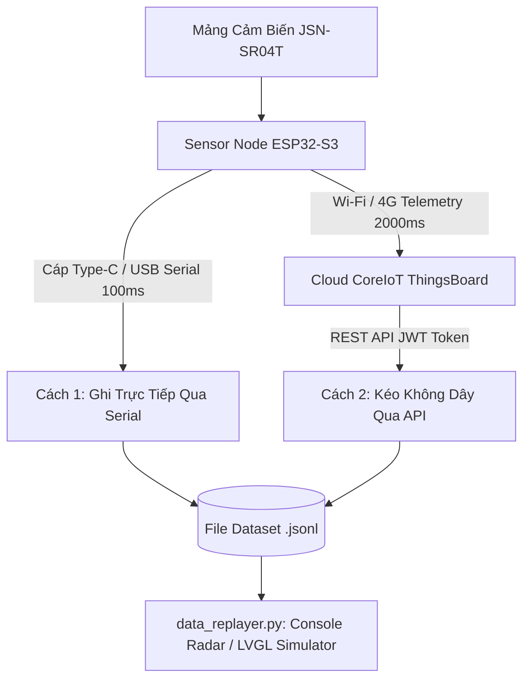

# Hướng Dẫn Thu Thập & Đo Đạc Dữ Liệu Cảm Biến Thực Tế (Recording SOP V2)

> **Mục tiêu:** Thu thập tập dữ liệu cảm biến thực tế chuẩn JSONL từ mảng 6 cảm biến JSN-SR04T (`sensor-node`), gán nhãn kịch bản phục vụ các mốc nghiệm thu:
> - **T1.4**: Ghi và phát lại dữ liệu thực nghiệm (DoD thực nghiệm trên Console/LVGL Simulator).
> - **T3.5**: Đo đạc độ trễ phản hồi của bộ lọc (`DistanceFilter` / moving average / jump reject) với vật cản chuyển động.
> - **T5.5 & T5.6**: Đo baseline độ ổn định, sai số (noise) và góc búp sóng của 6 cảm biến.
> - **T5.9**: Đánh giá tỷ lệ cảnh báo sai (false positive / missed detection).

---

## 🧭 Tổng Quan 2 Phương Pháp Thu Thập



| Tiêu Chí | Cách 1: Ghi qua Cáp USB Serial (`data_recorder.py`) | Cách 2: Kéo Không Dây (`fetch_telemetry_api.py`) |
| :--- | :--- | :--- |
| **Kết nối phần cứng** | Cắm cáp USB vào cổng `COM` máy tính. | Không cần dây. Xe chạy tự do, chỉ cần bắt Wi-Fi/4G. |
| **Tần suất lấy mẫu** | **Siêu nhanh (~100ms - 200ms/lần)**: Nhịp thật của vi điều khiển. | **Định kỳ (~2000ms/lần)**: Nhịp gửi Cloud CoreIoT. |
| **Phù hợp nhất cho** | Cân chỉnh độ trễ bộ lọc, đo sai số mili-giây, test tĩnh phòng Lab (**T3.5, T5.5**). | Test xe chạy thực tế trên đường, ngoài bãi bãi đỗ không kéo dây được (**T1.4, T5.9**). |

---

## 🛠️ Chuẩn Bị Trước Khi Đo (Setup)

### Bước 1: Cấu hình Khóa & Mạng (`config/keys.json`)
Mở file `config/keys.json` (được Gitignore bảo vệ an toàn theo quy tắc **R1**):
```json
{
  "COREIOT_BROKER": "app.coreiot.io",
  "COREIOT_PORT": 1883,
  "SENSOR_NODE_DEVICE_TOKEN": "ofaul7kj0skif2sczfwg",
  "WAVESHARE_SCREEN_DEVICE_TOKEN": "7dhqk8cscpt2qvgtss2z",
  "COREIOT_TELEMETRY_TOPIC": "v1/devices/me/telemetry",
  "WIFI_SSID": "KHOADOAN 0259",
  "WIFI_PASSWORD": "your_wifi_password",
  "COREIOT_USERNAME": "email_cua_ban@example.com",
  "COREIOT_PASSWORD": "mat_khau_cua_ban",
  "COREIOT_JWT": "eyJhbGciOiJIUzUxMiJ9..."
}
```
> [!TIP]
> **Khi kéo dữ liệu không dây, bạn chọn 1 trong 2 cách xác thực:**
> - **Cách A (Đơn giản):** Điền `COREIOT_USERNAME` và `COREIOT_PASSWORD` (email & mật khẩu tài khoản CoreIoT).
> - **Cách B (Bảo mật cao - Không cần mật khẩu):** Điền `COREIOT_JWT` (Token phiên đăng nhập).
>   - *Cách lấy JWT:* Đăng nhập [app.coreiot.io](https://app.coreiot.io) $\rightarrow$ Nhấn **F12** $\rightarrow$ Tab **Application** (hoặc Storage) $\rightarrow$ **Local Storage** $\rightarrow$ Copy giá trị của khóa `jwt_token`.

### Bước 2: Xác Định Cổng Serial / COM Của Thiết Bị Trên Máy Của Bạn 🔌

Mỗi máy tính khi cắm board ESP32 vào sẽ nhận một cổng COM khác nhau (ví dụ máy bạn là `COM7`, máy người khác có thể là `COM3`, `COM4` hoặc `/dev/ttyACM0`).

Để biết chính xác thiết bị đang ở cổng nào, hãy chạy lệnh sau trong PowerShell/Terminal:

```powershell
# Cách 1: Sử dụng PlatformIO để quét thiết bị
pio device list

# Cách 2: Sử dụng lệnh PowerShell nhanh trên Windows
Get-CimInstance Win32_PnPEntity | Where-Object { $_.Name -match "COM\d+" } | Select-Object Name, DeviceID
```

#### 📌 Dấu hiệu nhận diện thiết bị của dự án:
| Thiết Bị | Dấu hiệu nhận diện trên Windows | Dấu hiệu trên Linux / macOS |
| :--- | :--- | :--- |
| **Sensor Node**<br>(YOLO Uno ESP32-S3) | Tên `USB Serial Device (COMx)`<br>Chứa mã `VID_303A:1001` (Espressif Native USB) | `/dev/ttyACM0` hoặc `/dev/ttyACM1` |
| **Waveshare Screen**<br>(Màn hình 7 inch) | Tên `USB-Enhanced-SERIAL CH343 (COMx)`<br>Chứa mã `VID_1A86:55D3` (Chip CH343) | `/dev/ttyUSB0` hoặc `/dev/ttyACM0` |

---

### Bước 3: Nạp Firmware Chuẩn Cho Sensor Node
Sau khi xác định được cổng COM của Sensor Node (ví dụ `COM7` hoặc `COM4`):
```powershell
cd firmware/sensor-node
pio run -e yolo_uno_coreiot -t upload --upload-port <CONG_COM_CUA_SENSOR_NODE>
# Ví dụ thực tế trên Windows: pio run -e yolo_uno_coreiot -t upload --upload-port COM7
cd ../..
```

---

## 🚀 Cách 1: Thu Thập Dữ Liệu Qua Cáp Serial (Tần số 100ms)

Phương pháp này ghi nhận trực tiếp từng nhịp quét siêu âm của vi điều khiển (thay `<CONG_COM>` bằng cổng bạn vừa tìm được ở Bước 2):

```powershell
# 1. Ghi trong 15 giây rồi tự động dừng:
python tools/recorder/data_recorder.py --source serial --port <CONG_COM> --duration 15 -o data/recordings/real_test.jsonl
# Ví dụ: python tools/recorder/data_recorder.py --source serial --port COM7 --duration 15 -o data/recordings/real_test.jsonl

# 2. Hoặc ghi liên tục, khi nào hoàn thành bài test thì bấm Ctrl + C:
python tools/recorder/data_recorder.py --source serial --port <CONG_COM> -o data/recordings/real_test.jsonl
```

---

## 📡 Cách 2: Thu Thập Dữ Liệu Không Dây Qua REST API

Phương pháp này dành cho xe đang chạy ngoài bãi thử hoặc không cắm cáp vào máy tính:

### A. Ghi LIVE tính từ lúc bấm phím (`--live <số_giây>`)
Sử dụng khi bạn chuẩn bị cho xe chạy hoặc người đi qua cảm biến. Terminal sẽ hiển thị đồng hồ đếm ngược và tự động tải dữ liệu ngay khi hoàn tất:
```powershell
# Ghi nhận bài test 30 giây tới tính từ thời điểm bấm Enter:
python tools/recorder/fetch_telemetry_api.py --live 30 -o data/recordings/test_live.jsonl
```

### B. Lấy dữ liệu trong N giây vừa qua (`--seconds <số_giây>`)
Sử dụng khi bạn vừa thực hiện xong một bài test ngoài xe và muốn kéo dữ liệu đo của bài test đó về:
```powershell
# Lấy toàn bộ dữ liệu phát sinh trong 60 giây vừa qua:
python tools/recorder/fetch_telemetry_api.py --seconds 60 -o data/recordings/test_60s.jsonl
```

### C. Lấy toàn bộ lịch sử trong N giờ qua (`--hours <số_giờ>`)
```powershell
# Lấy tối đa 500 bản ghi trong 2 giờ gần nhất:
python tools/recorder/fetch_telemetry_api.py --hours 2 --limit 500 -o data/recordings/lich_su.jsonl
```

---

## 📋 4 Kịch Bản Thực Nghiệm Chuẩn Cần Đo

Tiến hành đo và lưu thành 4 tệp dữ liệu riêng biệt:

| Kịch Bản | Thao Tác Thực Nghiệm | Lệnh Thu Thập Khuyên Dùng | Mục Đích Đánh Giá |
| :--- | :--- | :--- | :--- |
| **1. Môi trường tĩnh** (*Static Clear*) | Cảm biến hướng vào không gian thoáng, không có vật cản gần (< 250 cm) trong 20s. | `python tools/recorder/data_recorder.py --source serial --port <PORT> --duration 20 -o data/recordings/real_static_clear.jsonl` | Baseline đo độ ổn định, sai số nhiễu jitter của cảm biến khi đứng yên (**T5.5**). |
| **2. Tiếp cận nguy hiểm** (*Approaching*) | Xe máy hoặc người đi từ xa (200 cm) tiến thẳng lại gần cảm biến (xuống 30–40 cm) với tốc độ ~3–5 km/h. | `python tools/recorder/data_recorder.py --source serial --port <PORT> --duration 20 -o data/recordings/real_approaching.jsonl` | Đánh giá tốc độ phản hồi của bộ lọc `DistanceFilter` xem có kịp báo trước va chạm không (**T3.5**). |
| **3. Cắt ngang góc mù** (*Cross Sensor*) | Vật cản đi ngang lần lượt qua các búp sóng cảm biến lân cận (`S1` $\rightarrow$ `S2` $\rightarrow$ `S3`). | `python tools/recorder/fetch_telemetry_api.py --live 30 -o data/recordings/real_cross_zones.jsonl` | Kiểm tra độ phủ búp sóng, phát hiện góc chết giữa 2 cảm biến cạnh nhau (**T5.6**). |
| **4. Rút dây / Che tay** (*Sensor Fault*) | Che sát tay vào đầu dò (< 15 cm) hoặc rút tạm chân Echo để mô phỏng sự cố. | `python tools/recorder/data_recorder.py --source serial --port <PORT> --duration 15 -o data/recordings/real_fault.jsonl` | Kiểm tra cờ lỗi `valid = 0` và cơ chế chuyển trạng thái `DISCONNECTED` (**T5.9**). |

---

## 📊 Cấu Trúc Dữ Liệu JSONL & Ý Nghĩa Các Trường

Mỗi dòng trong file `.jsonl` là một mốc thời gian hoàn chỉnh của hệ thống:
```json
{
  "timestamp_ms": 1790313936539,
  "elapsed_ms": 1950,
  "distances": [0.0, 0.0, 112.8, 0.0, 0.0, 0.0],
  "valid": [0, 0, 1, 0, 0, 0],
  "nearest_cm": 112.8,
  "has_nearest": true,
  "tag": "coreiot_rest",
  "source": "rest:app.coreiot.io"
}
```

- **`timestamp_ms`**: Thời gian tuyệt đối của hệ thống (epoch timestamp tính bằng mili-giây).
- **`elapsed_ms`**: **Thời gian tương đối tính từ lúc bắt đầu bài đo (frame đầu = 0ms)**.
  - Dùng để **phát lại đúng nhịp thời gian thực** (`data_replayer.py`).
  - Dùng làm **trục hoành (trục X)** khi vẽ biểu đồ khoảng cách theo thời gian.
  - Dùng để tính **tốc độ phản ứng** và **vận tốc tiếp cận** của vật cản ($v = \frac{\Delta d}{\Delta t}$).
- **`distances`**: Mảng khoảng cách 6 cảm biến (`S0 FRONT`, `S1 REAR`, `S2 LEFT_FRONT`, `S3 LEFT_REAR`, `S4 RIGHT_FRONT`, `S5 RIGHT_REAR`).
- **`valid`**: Cờ xác nhận độ tin cậy của từng cảm biến (`1` = hợp lệ trong dải 15cm - 500cm, `0` = mất tín hiệu / nhiễu).
- **`nearest_cm`**: Khoảng cách gần nhất trong các cảm biến đang phát hiện vật cản.

---

## 🎬 Phát Lại & Trực Quan Hóa Dữ Liệu (Replayer)

Sau khi có dữ liệu đo, sử dụng [`data_replayer.py`](file:///e:/Truck_Blind_Sight/tools/recorder/data_replayer.py) để mô phỏng lại bài test:

```powershell
# 1. Vẽ Radar màu trực tiếp trên Console (Terminal):
python tools/recorder/data_replayer.py --in data/recordings/real_approaching.jsonl --target console --speed 1.0

# 2. Phát nhanh gấp đôi (2x):
python tools/recorder/data_replayer.py --in data/recordings/real_approaching.jsonl --target console --speed 2.0

# 3. Bơm luồng dữ liệu qua UDP Socket vào bộ giả lập giao diện LVGL (Port 9090):
python tools/recorder/data_replayer.py --in data/recordings/real_approaching.jsonl --target udp
```
