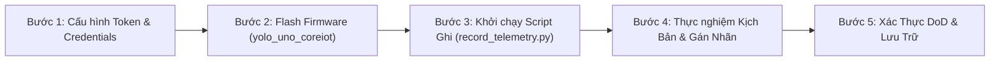

# Hướng Dẫn Thu Thập & Gán Nhãn Dữ Liệu Thực Tế (Real Telemetry Recording SOP)

> **Mục tiêu:** Thu thập tập dữ liệu cảm biến thật (JSONL) đầu tiên từ board `sensor-node` kết nối CoreIoT MQTT, gán nhãn kịch bản phục vụ việc mở khoá các nhiệm vụ trọng yếu:
> - **T1.4**: Ghi và phát lại dữ liệu thực tế (DoD thực nghiệm).
> - **T3.5**: Cân chỉnh độ trễ bộ lọc khoảng cách (`DistanceFilter` / moving average / jump confirm) cho vật thể chuyển động.
> - **T5.5 & T5.6**: Đo baseline độ ổn định, sai số và góc búp của 6 cảm biến siêu âm.
> - **T5.9**: Đánh giá tỷ lệ cảnh báo sai (false positive / missed detection).

---

## Quy Trình 5 Bước Thực Hiện



---

### Bước 1: Chuẩn bị Token CoreIoT & Sinh Credentials (Tuân thủ R1)

1. Mở file `config/keys.json` ở thư mục gốc dự án (file này được Gitignore bảo vệ).
2. Điền token thật của thiết bị **Sensor Node** lấy từ bảng điều khiển CoreIoT ([app.coreiot.io](https://app.coreiot.io)) cùng thông tin Wi-Fi của trạm test:
   ```json
   {
     "COREIOT_BROKER": "app.coreiot.io",
     "COREIOT_PORT": 1883,
     "SENSOR_NODE_DEVICE_TOKEN": "<TOKEN_THẬT_CỦA_SENSOR_NODE>",
     "WIFI_SSID": "<TÊN_WIFI>",
     "WIFI_PASSWORD": "<MẬT_KHẨU_WIFI>"
   }
   ```
3. Chạy script sinh header nội bộ `credentials.h` tự động:
   ```powershell
   python tools/guard/gen_credentials.py
   ```
   > [!NOTE]
   > Kiểm tra lại tính hợp lệ của file cấu hình bằng lệnh:
   > ```powershell
   > python tools/guard/gen_credentials.py --check
   > ```

---

### Bước 2: Build & Flash Firmware `sensor-node` (Environment `yolo_uno_coreiot`)

1. Cắm board `sensor-node` (ESP32-S3 / YOLO Uno) cùng mảng cảm biến JSN-SR04T vào máy qua cổng USB (giả sử cổng là `COM4`).
2. Build và nạp firmware có bật module CoreIoT:
   ```powershell
   cd firmware/sensor-node
   pio run -e yolo_uno_coreiot -t upload --upload-port COM4
   ```
3. Mở Serial Monitor để quan sát quá trình khởi động:
   ```powershell
   pio device monitor -p COM4 -b 115200
   ```
   - **Dấu hiệu thành công:**
     - Log in danh sách cảm biến không bị cảnh báo trùng GPIO nội bộ: `Supersonic sensor array started (6 cam bien)`.
     - Log Wi-Fi: `[NET] Connecting to WiFi SSID: ...` $\rightarrow$ Kết nối thành công.
     - Log MQTT: `[NET] Connecting to CoreIoT MQTT broker...` $\rightarrow$ `[NET] MQTT connected`.
     - Board bắt đầu gửi telemetry định kỳ (mặc định mỗi 200ms).

---

### Bước 3: Chạy Công Cụ Ghi Dữ Liệu (`tools/record_telemetry.py`)

Mở một cửa sổ PowerShell mới tại thư mục gốc dự án:

```powershell
# Ví dụ 1: Ghi tự động trong 30 giây rồi dừng
python tools/record_telemetry.py --seconds 30 --out data/recordings/real_test.jsonl

# Ví dụ 2: Ghi liên tục, bấm Ctrl + C khi hoàn thành kịch bản
python tools/record_telemetry.py --out data/recordings/real_test.jsonl
```

- Script tự động đọc `config/keys.json`, kết nối tới broker `app.coreiot.io`, subscribe topic `v1/devices/me/telemetry`.
- Mỗi bản tin nhận được sẽ được validate schema V2 (`d1..d6`, `nearest_cm`, `has_nearest`) và gắn thêm trường `recv_epoch_ms` (timestamp thời điểm PC nhận) để đo độ trễ truyền dẫn.

---

### Bước 4: Thực Hiện Các Kịch Bản Thực Nghiệm & Gán Nhãn (Labeling)

Tiến hành di chuyển vật cản thực tế theo 4 kịch bản chuẩn và lưu thành các file riêng biệt:

| Kịch Bản | Thao Tác Thực Nghiệm | Lệnh Thực Hiện | Mục Đích Sử Dụng |
| :--- | :--- | :--- | :--- |
| **1. Môi trường tĩnh / Trống** (*Static Clear*) | Cảm biến hướng vào không gian thoáng, không có vật cản gần (< 250 cm) trong 20s. | `python tools/record_telemetry.py --seconds 20 --out data/recordings/real_static_clear.jsonl` | Baseline đo độ ổn định, độ trôi của cảm biến khi đứng yên (**T5.5**). |
| **2. Tiếp cận nguy hiểm** (*Approaching Danger*) | Người hoặc xe đi từ xa (200 cm) tiến thẳng lại gần cảm biến (đến 30–40 cm) với tốc độ ~3–5 km/h. | `python tools/record_telemetry.py --seconds 25 --out data/recordings/real_approaching_danger.jsonl` | Cân chỉnh độ nhạy & độ trễ bộ lọc `DistanceFilter` phản ứng kịp trước va chạm (**T3.5**). |
| **3. Cắt ngang các vùng mù** (*Cross Sensor Zones*) | Vật cản đi ngang lần lượt qua các búp sóng cảm biến lân cận (ví dụ: `d1` $\rightarrow$ `d2` $\rightarrow$ `d3`). | `python tools/record_telemetry.py --seconds 30 --out data/recordings/real_cross_zones.jsonl` | Kiểm tra độ phủ búp sóng, không bị mù điểm chết giữa 2 cảm biến cạnh nhau (**T5.6**). |
| **4. Cảm biến lỗi / Rút dây** (*Fault & Blind Range*) | Che sát tay vào đầu dò (< 15 cm) hoặc rút tạm 1 chân Echo để mô phỏng sự cố. | `python tools/record_telemetry.py --seconds 20 --out data/recordings/real_sensor_fault.jsonl` | Đánh giá khả năng chuyển trạng thái `DISCONNECTED` và tránh báo động ảo (**T5.9**). |

---

### Bước 5: Kiểm Tra Xác Thực Dữ Liệu (DoD) & Lưu Trữ

1. **Xác minh tính toàn vẹn (Dry-run):**
   Chạy bộ phát lại với cờ `--dry-run` để kiểm tra toàn bộ định dạng JSONL, số dòng, khoảng cách âm hoặc sai lệch timestamp:
   ```powershell
   python tools/replay_telemetry.py --in data/recordings/real_approaching_danger.jsonl --dry-run
   ```
   *Yêu cầu:* Kết quả trả về `Schema OK: [Tổng số dòng]` và mã thoát bằng 0.

2. **Mô phỏng phát lại trực quan trên Terminal:**
   ```powershell
   python tools/recorder/data_replayer.py --input data/recordings/real_approaching_danger.jsonl --target console
   ```

3. **Lưu trữ vào Git:**
   > [!IMPORTANT]
   > Kiểm tra tuyệt đối không commit file cấu hình chứa key thật `config/keys.json` (tuân thủ quy tắc **R1**).
   ```powershell
   git status
   git add data/recordings/real_*.jsonl
   git commit -m "feat(data): record first real-world telemetry datasets for T1.4, T3.5, T5.5"
   ```

---

## Xử Lý Sự Cố Thường Gặp (Troubleshooting)

- **Lỗi MQTT connect failed (state = -2 hoặc -4):**
  - Kiểm tra xem máy tính và board có cùng ra được Internet không.
  - Kiểm tra Token `SENSOR_NODE_DEVICE_TOKEN` trong `config/keys.json` có đúng với Token trên CoreIoT chưa.
- **Board ESP32 bị sụt áp / reset liên tục khi bật Wi-Fi:**
  - Chip ESP32-S3 phát Wi-Fi TX tiêu thụ dòng đỉnh tới ~500mA. Dùng dây USB cấp nguồn tốt hoặc cắm thêm nguồn phụ 5V ngoài cho board và mảng cảm biến.
- **Không nhận được Echo / Cảm biến báo REJECT liên tục:**
  - Kiểm tra điện áp cấp cho đầu dò JSN-SR04T (JSN-SR04T chuẩn cần 5V VCC để bộ phát siêu âm hoạt động ổn định).
