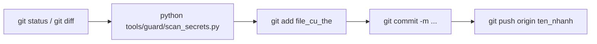

# Hướng Dẫn Sử Dụng Git Cho Dự Án Truck Blind Sight (UMT-TBS)

Tài liệu này hướng dẫn chi tiết quy trình làm việc với Git dành riêng cho dự án **Truck Blind Sight**, tuân thủ nghiêm ngặt các quy tắc an toàn bảo mật (R1–R12 trong `CONSTITUTION.md` & `CONTRIBUTING.md`).

---

## 📌 3 Quy Tắc Vàng Bắt Buộc Của Dự Án

| Quy tắc | Chi tiết |
| :--- | :--- |
| **1. CẤM `git add .` hoặc `git add -A`** | Hệ thống nhúng ESP32 sinh ra nhiều file build `.pio/`, cấu hình nhạy cảm. **Chỉ add từng file cụ thể** bạn muốn đưa lên. |
| **2. Quét bảo mật trước khi commit** | Luôn chạy `python tools/guard/scan_secrets.py` để đảm bảo không dính Token CoreIoT, mật khẩu Wi-Fi (`config/keys.json`). |
| **3. Luôn dùng `--rebase` khi pull** | `git pull origin <branch> --rebase` để giữ lịch sử commit thẳng, sạch, không tạo commit "Merge branch...". |

---

## 🚀 Quy Trình Làm Việc Chuẩn (Step-by-Step)



### Bước 1: Kiểm tra các file bạn vừa chỉnh sửa
Trước khi làm bất cứ thao tác nào, hãy kiểm tra danh sách file đã đổi:
```bash
git status
```
Xem chi tiết bạn đã sửa những dòng nào trong file:
```bash
git diff <đường_dẫn_file>
# Ví dụ: git diff firmware/shared/thresholds.h
```

### Bước 2: Quét bảo mật (Security Scan)
Chạy công cụ kiểm tra tự động của dự án:
```bash
python tools/guard/scan_secrets.py
```
👉 **Đạt yêu cầu**: Terminal báo `SECRET-SCAN OK: no secret patterns found.`  
❌ **Bị chặn**: Nếu phát hiện secret, terminal sẽ chỉ rõ file và dòng nghi vấn để bạn gỡ ra trước.

### Bước 3: Thêm các file cụ thể vào hàng đợi (Staging)
**Chỉ add đúng các file bạn đã kiểm tra:**
```bash
# Ví dụ: add file code cảm biến và file log
git add firmware/sensor-node/src/main.cpp
git add firmware/shared/thresholds.h
git add docs/logs/WAVESHARE_SCREEN_LATENCY_FLICKER_FIX_LOG.md
```

### Bước 4: Tạo commit với thông điệp chuẩn (Conventional Commits)
```bash
git commit -m " <mô tả ngắn gọn bằng tiếng Anh hoặc tiếng Việt>"
```

**Các tiền tố `<type>` quy ước của dự án:**
- `feat:` Thêm tính năng mới (ví dụ: `feat(sensor): add adaptive polling for missing sensors`)
- `fix:` Sửa lỗi (ví dụ: `fix(screen): resolve display freeze on DANGER transition`)
- `perf:` Tối ưu hiệu năng, độ trễ (ví dụ: `perf(espnow): reduce send interval to 100ms`)
- `docs:` Viết hoặc sửa tài liệu, log (ví dụ: `docs(log): update screen flicker diagnosis`)
- `refactor:` Tái cấu trúc code nhưng không đổi tính năng (ví dụ: `refactor(ui): split layout helper`)
- `chore:` Dọn dẹp, chỉnh cấu hình build (ví dụ: `chore(pio): set upload speed 921600`)

### Bước 5: Đẩy (Push) code lên GitHub
Đẩy lên nhánh bạn đang làm việc (ví dụ nhánh `khoa`):
```bash
git push origin khoa
```
*(Nếu là lần đầu đẩy nhánh này lên, thêm cờ `-u`: `git push -u origin khoa`)*

---

## 🌿 Quản Lý Nhánh (Branching Workflow)

Khi làm việc, nên tạo nhánh riêng để phát triển thay vì đẩy thẳng vào `main`.

### 1. Xem danh sách các nhánh
```bash
git branch        # Xem các nhánh ở máy của bạn
git branch -a     # Xem tất cả các nhánh (cả trên GitHub)
```

### 2. Tạo nhánh mới và chuyển sang nhánh đó
```bash
git checkout -b <tên_nhánh>
# Ví dụ: tạo nhánh làm việc riêng của bạn
git checkout -b khoa
```

### 3. Chuyển đổi qua lại giữa các nhánh có sẵn
```bash
git checkout main    # Về lại nhánh main
git checkout khoa    # Sang lại nhánh khoa
```

### 4. Cập nhật code mới nhất từ nhánh `main` vào nhánh của bạn
Khi nhánh `main` có cập nhật từ đồng đội, hãy đồng bộ vào nhánh của bạn:
```bash
git fetch origin
git rebase origin/main
```

---

## 🛠️ Các Tình Huống Thường Gặp & Cách Cứu Nguy (Cheat Sheet)

### 1. Lỡ sửa nhầm một file và muốn hủy thay đổi để quay về code cũ
```bash
git restore <đường_dẫn_file>
# Ví dụ:
git restore firmware/waveshare-screen/src/main.c
```

### 2. Lỡ gõ `git add` nhầm một file và muốn bỏ ra khỏi hàng đợi
*(Chỉ bỏ khỏi staging, không làm mất code bạn đã viết)*:
```bash
git restore --staged <đường_dẫn_file>
# Ví dụ:
git restore --staged config/keys.json
```

### 3. Vừa gõ `git commit` xong nhưng phát hiện viết sai thông điệp
```bash
git commit --amend -m "fix(screen): thông điệp mới chính xác hơn"
```

### 4. Xem lịch sử các commit gần đây một cách trực quan
```bash
git log --oneline -n 10 --graph
```

### 5. Đang code dở mà cần chuyển gấp sang nhánh khác kiểm tra
Dùng `stash` để cất tạm công việc dở dang:
```bash
git stash               # Cất tạm các file đang sửa dở
git checkout main       # Chuyển nhánh làm việc khác
# ... làm xong quay lại nhánh cũ ...
git checkout khoa
git stash pop           # Lấy lại phần code đang dở dang
```

### 6. Xử lý khi bị xung đột (Merge Conflict) lúc pull/rebase
Nếu `git pull --rebase` báo `CONFLICT`:
1. Mở các file bị báo conflict lên, tìm đoạn `<<<<<<< HEAD` và `>>>>>>>` để chọn giữ code nào.
2. Lưu file lại.
3. Chạy:
   ```bash
   git add <file_đã_sửa_conflict>
   git rebase --continue
   ```
*(Tuyệt đối không chạy `git commit` trong lúc đang rebase)*.

---

## 📋 Bảng Tóm Tắt Lệnh Nhanh Cho Dự Án

| Thao tác | Lệnh |
| :--- | :--- |
| Kiểm tra trạng thái file | `git status` |
| Quét bí mật bắt buộc | `python tools/guard/scan_secrets.py` |
| Thêm file cụ thể | `git add <tên_file>` |
| Lưu commit | `git commit -m "<type>: <mô tả>"` |
| Kéo code mới về (rebase) | `git pull origin <tên_nhánh> --rebase` |
| Đẩy code lên GitHub | `git push origin <tên_nhánh>` |
| Tạo và chuyển nhánh mới | `git checkout -b <tên_nhánh>` |
| Xem lịch sử ngắn gọn | `git log --oneline -n 5` |
